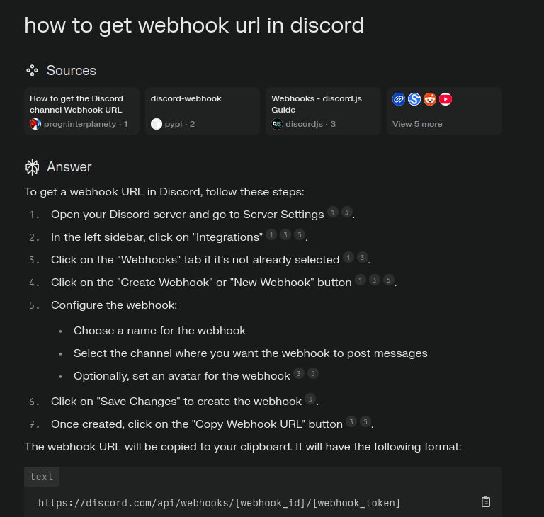

# Alerter service

## deployment
- use attached info to build the docker container
- then use docker-compose.yaml to start the service
- be sure to provide proper webooks to intergrate with your own discord server

## getting webhooks in discord

- if we want to @mention users, then their role_id must be captured
  - in server settings>roles
  - right click on role> copy_role_ID --> eg. 1022914600000000000
